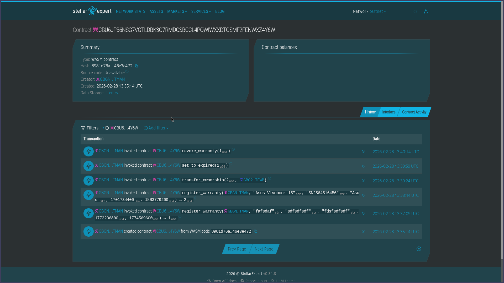
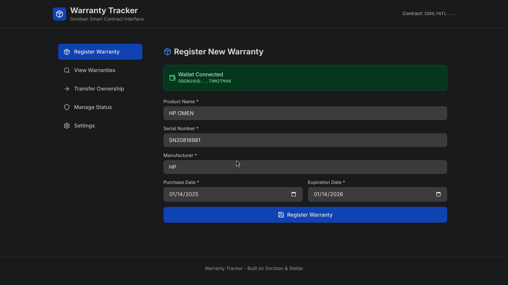
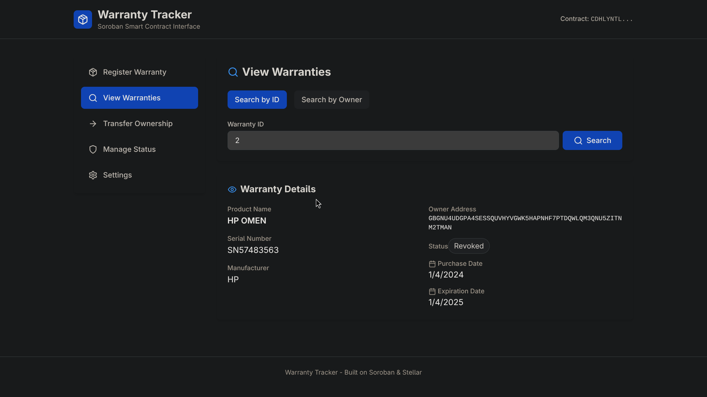
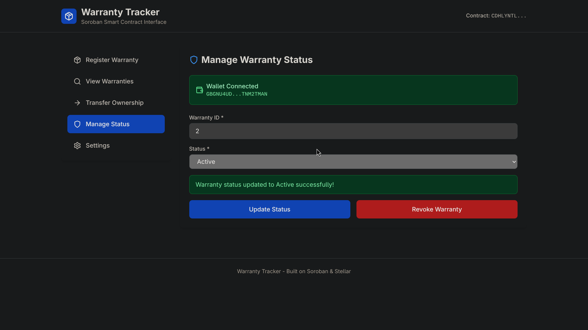
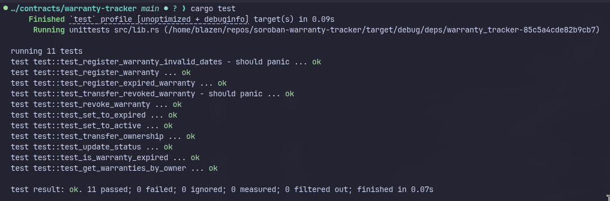

# 🔐 Warranty Tracker

A Soroban smart contract for tracking product warranties on the Stellar network. This contract allows users to register, manage, and transfer warranties in a decentralized and immutable way.

## 🌐 Live Demo & Deployed Contract

**Frontend**: [https://soroban-warranty-tracker.vercel.app/](https://soroban-warranty-tracker.vercel.app/)

**Testnet Contract ID:** `CBU6JP36NSG7VGTLDBK3O7RMDCSBCCL4PQWIWXXDTGSMF2FENWXZ4Y6W`



> 💡 **Note:** Connect your Freighter wallet and start tracking warranties on Stellar testnet! To use this contract in the frontend, paste the Contract ID in the Settings section if needed.


## 📹 Demo Video


## ✨ Features

- 📝 **Warranty Registration**: Register warranties with product details, serial numbers, and expiration dates
- 🔍 **Owner-based Querying**: Efficiently query all warranties owned by a specific address
- 🔄 **Ownership Transfer**: Transfer warranty ownership between addresses (only for active warranties)
- 📊 **Status Management**: Update warranty status (Active, Expired, Revoked) with owner-based access control
- ⏰ **Automatic Expiration**: Automatically detect and mark warranties as expired based on expiration dates
- 🔒 **Access Control**: Only warranty owners can modify or transfer their warranties

## Project Visuals

 
 


## 📋 Prerequisites

Before you begin, ensure you have the following installed:

- 🦀 [Rust](https://www.rust-lang.org/tools/install) (latest stable version)
- ⭐ [Stellar CLI](https://developers.stellar.org/docs/tools/stellar-cli) (for contract deployment)
- 🔧 [Soroban CLI](https://soroban.stellar.org/docs/getting-started/setup#install-the-soroban-cli)

## 📁 Project Structure

```
.
├── assets/                  # Screenshots and media (replace .svg placeholders with .png)
├── contracts/
│   └── warranty-tracker/
│       ├── src/
│       │   ├── lib.rs       # Main contract implementation
│       │   └── test.rs      # Test suite
│       ├── Cargo.toml       # Contract dependencies
│       └── Makefile         # Build and test commands
├── frontend/                # React + Vite frontend
├── Cargo.toml               # Workspace configuration
└── README.md
```

## 🔨 Building

Build the contract:

```bash
cd contracts/warranty-tracker
make build
```

Or use the Stellar CLI directly:

```bash
stellar contract build
```

The compiled WASM file will be located at:

```
target/wasm32v1-none/release/warranty_tracker.wasm
```

## 🚀 Deployment

### Contract Deployment

To deploy the contract to the Soroban network:

1. **Build the contract** (see above)
2. **Set up a Stellar account** on testnet (testnet)
3. **Deploy the contract** using Stellar CLI
4. **Get the Contract ID** from the deployment output
5. **Configure your frontend** with the Contract ID

For detailed contract deployment instructions, see [CONTRACT_DEPLOYMENT.md](./CONTRACT_DEPLOYMENT.md).

#### Quick Deploy to testnet

```bash
# 1. Generate account or add existing one
stellar keys generate deployer --network testnet --fund
#    OR add existing account:
stellar keys add deployer --secret-key <your-secret-key>

# 2. Get testnet funds
stellar keys fund deployer --network testnet
#    OR manually:
curl "https://friendbot-testnet.stellar.org/?addr=<YOUR_PUBLIC_KEY>"

# 3. Build the contract
stellar contract build

# 4. Deploy (replace 'deployer' with your account name)
stellar contract deploy \
  --wasm target/wasm32v1-none/release/warranty_tracker.wasm \
  --source deployer \
  --network testnet

# 5. Copy the Contract ID and use it in your frontend Settings!
```

### Frontend Deployment

The frontend is deployed and live at: **[https://soroban-warranty-tracker.vercel.app/](https://soroban-warranty-tracker.vercel.app/)**

For frontend deployment instructions, see [FRONTEND_DEPLOYMENT.md](./FRONTEND_DEPLOYMENT.md).

## 🧪 Testing

Run the test suite:

```bash
cd contracts/warranty-tracker
make test
```

Or use Cargo directly:

```bash
cargo test
```

The test suite covers:

- ✅ Warranty registration with validation
- 🔍 Querying warranties by ID and owner
- 📊 Status updates (Active, Expired, Revoked)
- 🔄 Ownership transfers
- 🚫 Transfer restrictions for non-active warranties
- ⏰ Expiration detection

---

## ✅ Test Results

 

## 📡 Contract API

### 📝 `register_warranty`

Register a new warranty.

**Parameters:**

- `owner: Address` - The address that owns this warranty
- `product_name: String` - Name of the product
- `serial_number: String` - Serial number of the product
- `manufacturer: String` - Manufacturer name
- `purchase_date: u64` - Purchase date as Unix timestamp
- `expiration_date: u64` - Warranty expiration date as Unix timestamp

**Returns:** `u64` - The warranty ID

**Requirements:**

- Owner must authenticate the transaction
- `expiration_date` must be after `purchase_date`
- `purchase_date` cannot be in the future

**Status Assignment:**

- Automatically sets status to `Expired` if `expiration_date` is in the past
- Otherwise sets status to `Active`

### 🔍 `get_warranty`

Get warranty details by ID.

**Parameters:**

- `warranty_id: u64` - The warranty ID to query

**Returns:** `Option<WarrantyData>` - The warranty details or None if not found

### 📋 `get_warranties_by_owner`

Get all warranty IDs owned by a specific address.

**Parameters:**

- `owner: Address` - The owner address

**Returns:** `Vec<u64>` - Vector of warranty IDs owned by the address

### 📊 `update_status`

Update warranty status. Only the owner can update the status.

**Parameters:**

- `warranty_id: u64` - The warranty ID to update
- `status: WarrantyStatus` - The new status (Active, Expired, or Revoked)

**Requirements:**

- Owner must authenticate the transaction

### 🔄 `transfer_ownership`

Transfer warranty ownership to another address.

**Parameters:**

- `warranty_id: u64` - The warranty ID to transfer
- `new_owner: Address` - The new owner address

**Requirements:**

- Current owner must authenticate the transaction
- Warranty must be in `Active` status (cannot transfer expired or revoked warranties)

**Effects:**

- Updates the warranty owner
- Removes warranty ID from old owner's list
- Adds warranty ID to new owner's list

### 🚫 `revoke_warranty`

Revoke a warranty. Only the owner can revoke.

**Parameters:**

- `warranty_id: u64` - The warranty ID to revoke

**Requirements:**

- Owner must authenticate the transaction

**Effects:**

- Sets warranty status to `Revoked`

### 📈 `get_warranty_count`

Get the total number of registered warranties.

**Returns:** `u64` - Total warranty count

### ⏰ `is_warranty_expired`

Check if a warranty is expired based on current time.

**Parameters:**

- `warranty_id: u64` - The warranty ID to check

**Returns:** `bool` - `true` if warranty is expired, `false` otherwise

## 🏗️ Data Structures

### `WarrantyData`

```rust
pub struct WarrantyData {
    pub id: u64,                     // Unique warranty identifier
    pub owner: Address,              // Current owner address
    pub product_name: String,        // Product name
    pub serial_number: String,       // Product serial number
    pub manufacturer: String,        // Manufacturer name
    pub purchase_date: u64,          // Purchase date (Unix timestamp)
    pub expiration_date: u64,        // Expiration date (Unix timestamp)
    pub status: WarrantyStatus,      // Current status
    pub created_at: u64,             // Creation timestamp
}
```

### `WarrantyStatus`

```rust
pub enum WarrantyStatus {
    Active,    // Warranty is active
    Expired,   // Warranty has expired
    Revoked,   // Warranty has been revoked
}
```

## 💡 Usage Example

Here's a basic example of how to interact with the contract:

```rust
// Register a warranty
let warranty_id = contract.register_warranty(
    &owner,
    &String::from_str(&env, "Laptop Pro 2024"),
    &String::from_str(&env, "SN123456789"),
    &String::from_str(&env, "TechCorp"),
    &1704067200,  // purchase_date
    &1735689600,  // expiration_date (1 year later)
);

// Query warranty details
let warranty = contract.get_warranty(&warranty_id);

// Get all warranties for an owner
let owner_warranties = contract.get_warranties_by_owner(&owner);

// Transfer ownership
contract.transfer_ownership(&warranty_id, &new_owner);

// Revoke warranty
contract.revoke_warranty(&warranty_id);

// Check expiration
let is_expired = contract.is_warranty_expired(&warranty_id);
```

## 🛠️ Development

### 🎨 Code Formatting

Format the code:

```bash
cargo fmt --all
```

### 🧹 Clean Build Artifacts

Clean build artifacts:

```bash
cargo clean
```

## 🔐 Security Considerations

- 🔒 **Access Control**: All write operations require owner authentication
- ✅ **Validation**: Purchase dates and expiration dates are validated on registration
- 🚫 **Transfer Restrictions**: Only active warranties can be transferred
- 📜 **Immutable History**: Once registered, warranty data cannot be deleted, only status can be updated

## 📄 License

This project is licensed under the MIT License.

## 🤝 Contributing

Contributions are welcome! Please feel free to submit a Pull Request.

## 📚 Resources

- 📖 [Soroban Documentation](https://soroban.stellar.org/docs)
- ⭐ [Stellar Documentation](https://developers.stellar.org/)
- 📘 [Soroban SDK Reference](https://docs.rs/soroban-sdk/)
